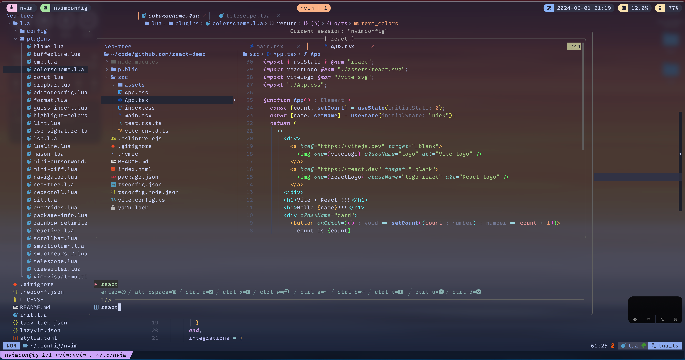

# sunjr's dotfiles

Hi, here is my dev setup!

### tmux


### neovim

- remove extras from config/lazy.lua
- you have to enable lazyvim extras with `:LazyExtras` command

```lua
-- use below 😄
vim.keymap.set("n", "i", function()
  return string.match(vim.api.nvim_get_current_line(), "%g") == nil and "cc" or "i"
end, { expr = true, noremap = true })

```

### screenshots


> new fzf-lua so great!!!


> tmux-floax also great!!!



