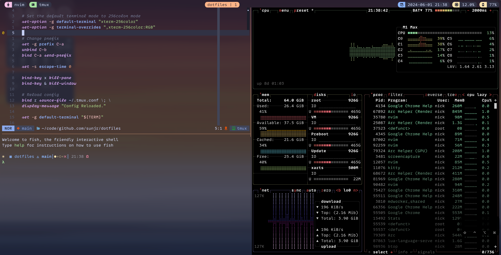

# sunjr's dotfiles

Hi, here is my dev setup!

### tmux



### neovim

```lua
-- use below 😄
vim.keymap.set("n", "i", function()
  return string.match(vim.api.nvim_get_current_line(), "%g") == nil and "cc" or "i"
end, { expr = true, noremap = true })

```

### screenshots


